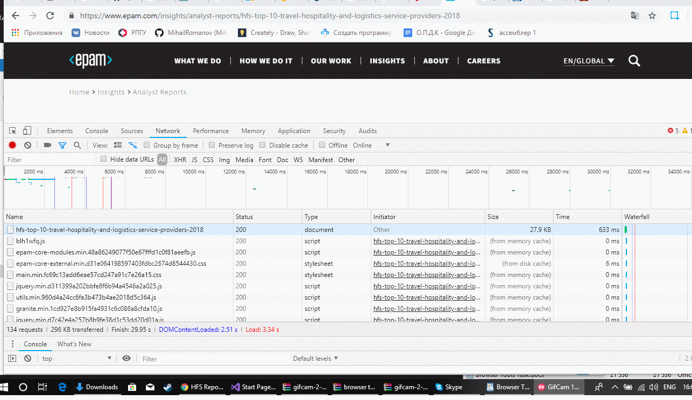
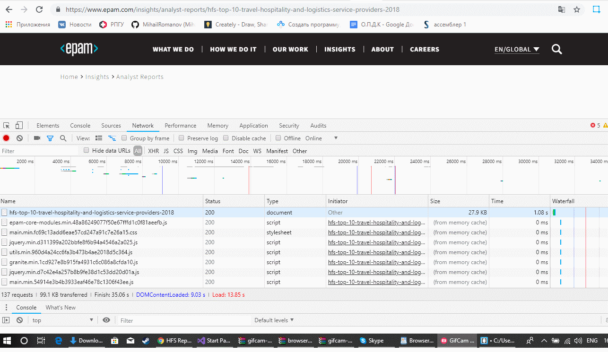
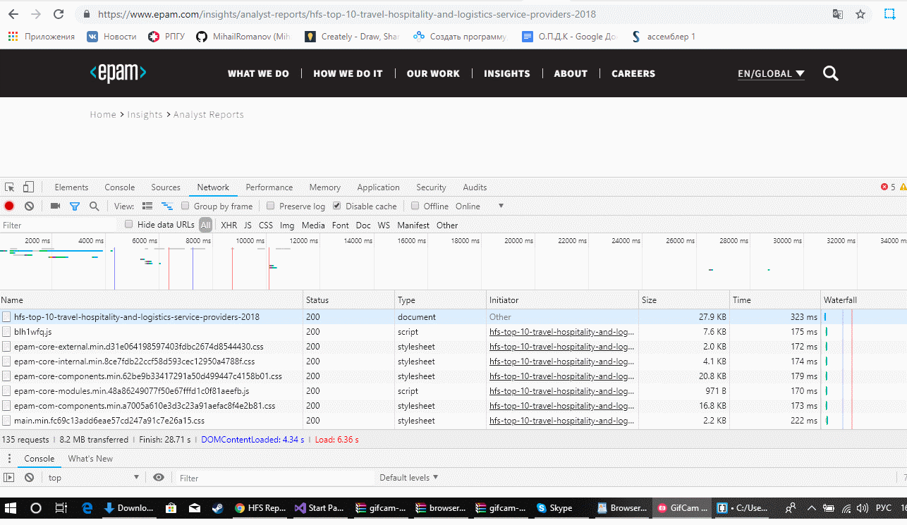
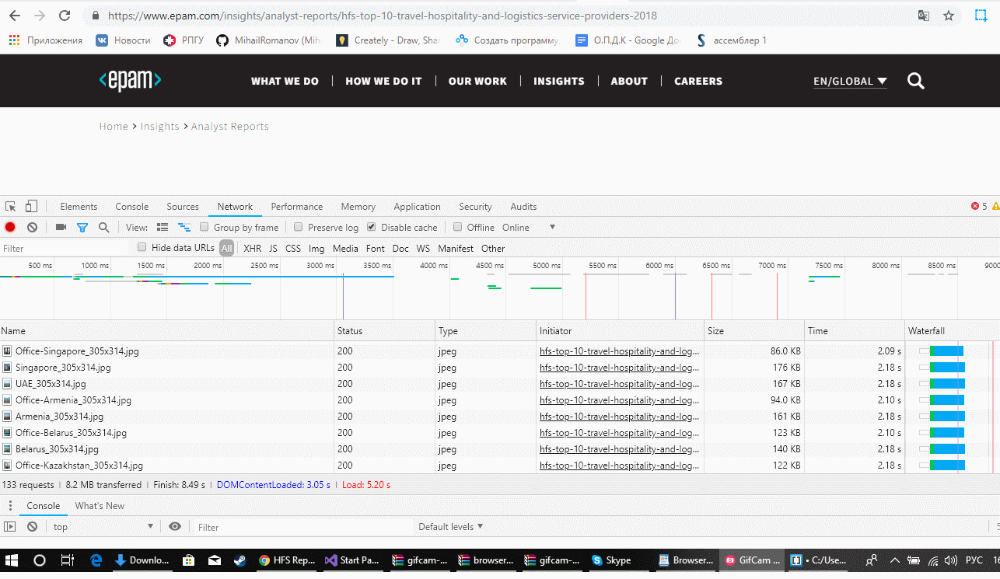

* Изменить название элемента.

* Переместить элемент на другой уровень, например, вложить один элемент в другой.

* Добавить атрибут на элемент.

* Изменить значение существующего атрибута.

* Удалить все дочерние элементы у выбранного элемента.

* В вкладке Timing найти время сколько времени браузер скачивал и сколько времени ожидал.

Дополнительное задание

* Включить очистку кеша обновить сайт посмотреть сколько времени ушло на полную загрузку сайта, включить кэш посмотреть сколько времени ушло на полную загрузку сайта, в каком случае сайт загружается быстрее?
- С кешом. Загрузка быстрее.

- Без кеша.

* Выбрать любой запрос в открывшейся панели найти метод, статус код и url запроса.
